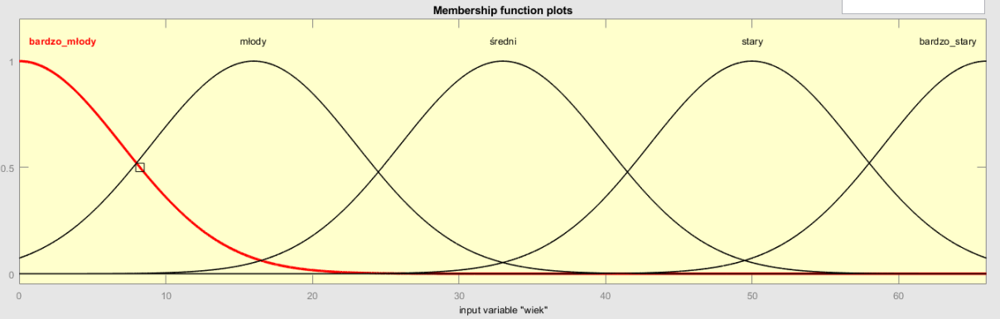
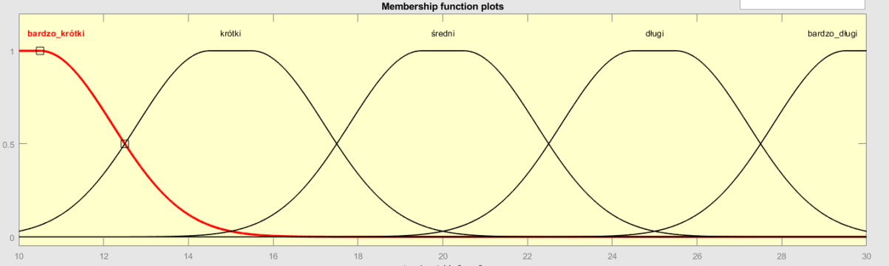
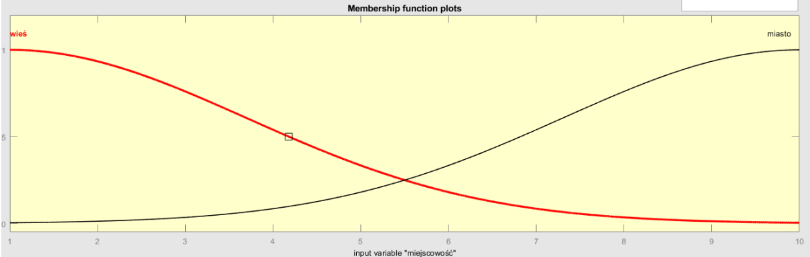
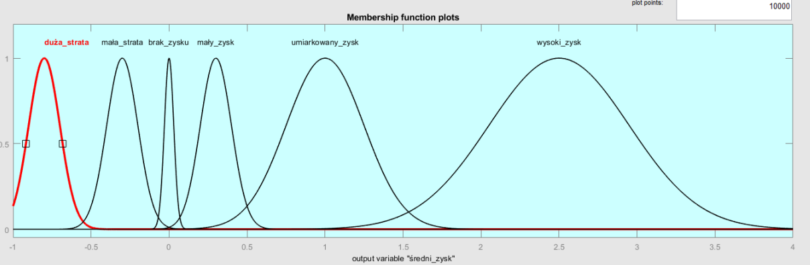
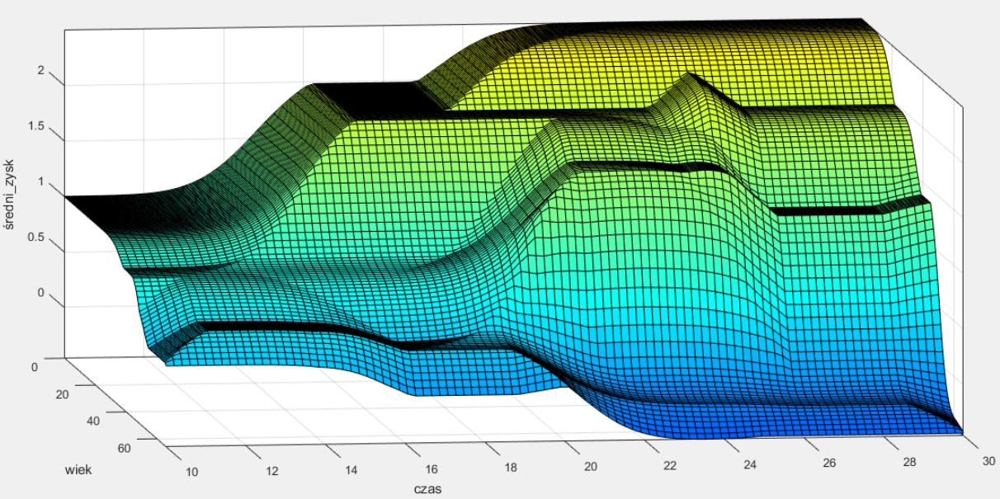

# Analysis of the profitability of life annuities for men based on age, duration of the insurance, and place of residence

The project focuses on assessing the profitability of life annuities, which is a critical issue in financial risk management and personal planning. Life annuity is a financial product that may be especially significant in the context of an aging population and changing economic conditions. Understanding the impact of age, policy duration, and place of residence on the average profit from the insurance is crucial for insurers and insureds to develop insurance products that are both attractive and financially sustainable. The choice of this problem is justified by the need to better understand the dynamics of insurance risk and potential return on investment in life insurance. Average profit is a measure that enables the assessment of whether and to what extent an insurance policy is profitable.

## Technologies

* Python
* Pandas
* Numpy
* Mamdani

## Launch

To conduct the analysis, I created a Python program that calculates average profit. Based on the results obtained, I created appropriate rules in MATLAB. To get the results, you need to download the 'ubezpieczenieNaDożycie.fis' file and run it in the MATLAB application.

## Practical applications

* Insurance companies: They can use the system to tailor life insurance offers to individual customer needs, predicting both risk and profitability.
* Banks and financial institutions: They can offer personalized retirement or investment products based on risk assessment and expected returns.
* Financial advisors and retirement planners: They can use the system for better advising clients on financial planning for old age.

The problem has been addressed in other ways:

* Statistical risk models: Traditional models use statistics and probability theories to assess risk, but they may not be flexible enough for unconventional conditions.
* Monte Carlo simulations: Used for risk assessment by generating thousands of scenarios, but require substantial computing power and are complex to interpret.
* Actuarial models: Specialized models used in the insurance industry, which often rely on rigid assumptions and may not take local conditions into account.

## Screenshots

* Input variable: age - graphical representation

* Input variable: Time - graphical representation

* Input variable: Location - graphical representation

* Output variable: Average profit - graphical representation

* Age-time graph

## Project Status

The project is complete.

## Knowledge Acquisition Process

The process of acquiring knowledge about annuities and their interest rates was based on the following sources:

* Wikipedia - Life Annuity: General information about the nature of life annuities, their types, and functionality. 

https://pl.wikipedia.org/wiki/Ubezpieczenie_na_do%C5%BCycie

* Good Life Policy - Life and Survival Insurance: Detailed information on life and survival insurance offers, including terms and policy structure.

https://www.dobrapolisanazycie.pl/poradniki/ubezpieczenie-na-zycie-i-dozycie-co-to-za-polisa/

* Life Insurance Mathematics - Basic Life Insurance: Formulas and calculations used in the insurance industry, including the formula for calculating the future value of an insurance policy.

https://pl.wikibooks.org/wiki/Matematyka_ubezpiecze%C5%84_%C5%BCyciowych/Podstawowe_ubezpieczenia_%C5%BCyciowe

## Contact

Link to the LinkedIn profile

https://www.linkedin.com/in/klaudia-malon-898330305/

